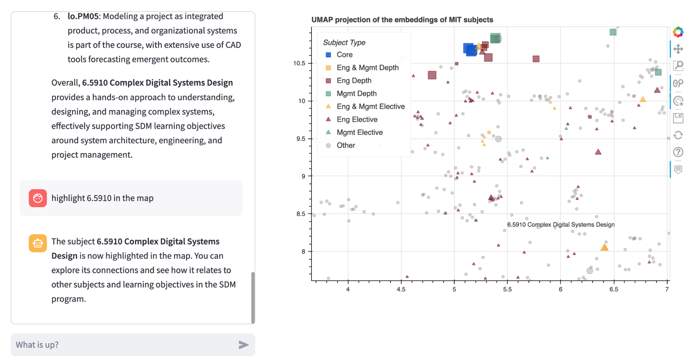

# MIT Subject Explore

Explore MIT subjects by chating with a virtual academic advisor and browsing the map!



## Create a virtual environment

 macOS/Linux:

```bash
python -m venv .venv
source .venv/bin/activate
```

Windows:

```bash
python -m venv env
.\env\Scripts\activate
```

## Install the requirements

```bash
pip install -r requirements.txt
```

## Run streamlit

```bash
streamlit run app.py
```
